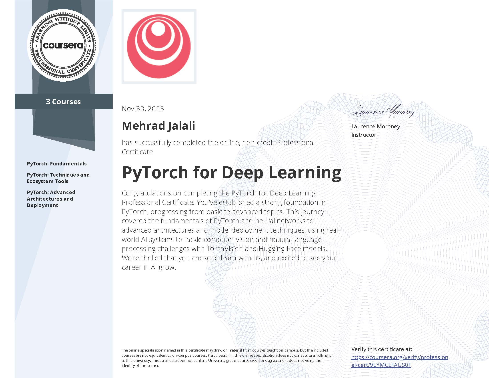

# PyTorch for Deep Learning - Coursera Solutions

This repository contains my personal solutions to the programming assignments for the **[Deep Learning with PyTorch Professional Certificate](https://www.coursera.org/professional-certificates/pytorch-for-deep-learning)** on Coursera.

All notebooks are organized by course module and are intended for reference.

## 📝 Course Notes & Summary
I have compiled detailed notes during the course which act as a summary of the key concepts. You can access and view them via the link below:

👉 **[View My Personal Course Notes (PDF)](https://drive.google.com/file/d/1BNGcoPmWCwmjhSKXBNkMi8sMAqUKhDT4/view?usp=sharing)**

---
*Disclaimer: These solutions are for educational purposes. Please try to solve the assignments yourself before checking the code.*